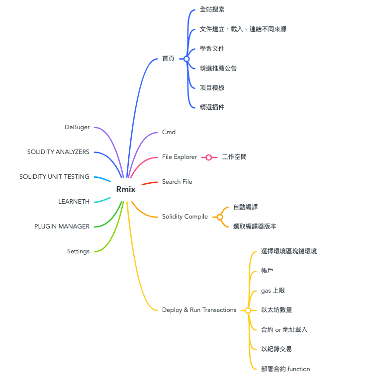
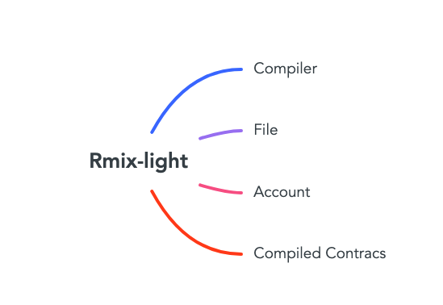

## DJQ
1. 在 GCC 周会上又过了一遍 grants 提案。关于 vscode 插件和 webcontainer 部分的预算，因为没有比较详细的计划，所以被砍了。我和 Rory 会针对 vscode 插件尽快制定一个可行的开发计划。
2. brochain ide 已完成测试。在测试阶段发现了有 6 个 bug 是 remix 本身的 bug ，已经给官方提了 issue 和 pr。后面计划在 PET 上做一次技术分享。

## Mocca

## Rory
Rmix vs Rmix-light 分析
1. 开发语言（框架不涉及插件）
    - Rmix
      - react ^17.0.2
      - [nx](https://nx.dev/getting-started/intro)
      - TypeScript
    - Rmix-light
      - react ^17.0.2
      - TypeScript
      - @vscode/codicons
      - @remix-project/remix-simulator
      - tailwind
2. 功能
  - Rmix
    
  - Rmix-light
    
3. 杂想
    - 目前还看了几套感觉很雷同，都是整合 Debug 和 部署
        - Ethereum Rimx （官方的）
        - Solidity development
            https://soliditydebugger.org/
        - layer solidity 选择部署，呈现ABI 呼叫
            https://marketplace.visualstudio.com/items?itemName=Chaintown.layer
    - 应该可以加强（简化）本地端开发的难度，确实目前只有 hardhat 的连动部署 （初步评估因该很多套件有使用了（Solidity development）
    - 画面上设计只要造 @vscode/codicons 开发没啥问题，可以控制右侧也可以tab开启画面
    - 可能在想让编译方便整合本地 debg 和产出 EIP 合约场景因该会是很好的推广。

## issue
1. https://github.com/ethereum/remix-project/issues/3684
2. https://github.com/ethereum/remix-project/issues/3887
3. https://github.com/ethereum/remix-project/issues/3888
4. https://github.com/ethereum/remix-project/issues/3889
5. https://github.com/ethereum/remix-project/issues/3890
6. https://github.com/bunsenstraat/remix-learneth-plugin/issues/75

## vscode 插件
我想以尽可能少的成本，尽快做点东西出来。初步想法是在 vscode 上完美复刻 Remix 的 `Deploy & Run Transactions` 模块。主要基于以下两点考虑
1. 社区已经有一个插件叫 remix-light ，这其实就是一个精简版的 `Solidity Compiler` + `Deploy & Run Transactions` 。这个插件对我们有很强的借鉴意义，可以节省我们不少时间
2. 在 brochain ide 中我就是复制了 `Deploy & Run Transactions` 模块的代码，实现了 brochain 插件。所以我对这部分代码已经是非常熟悉了

具体开发步骤会分两步走
1. 将 `Deploy & Run Transactions` 移植到 iframe 插件中。这样我们就很清楚 `Deploy & Run Transactions` 依赖了 Remix 哪些 api
2. 开发一个中间层，把 `Deploy & Run Transactions` 依赖 Remix 的这些 api 用 vscode 的 api 实现一遍

iframe 版的 `Deploy & Run Transactions` 虽然是我们的附加产出，但其本身也是很有价值的。因为 Remix 官方并没有提供一个很好的方式让那些和 Ethereum 不太兼容的链集成到 Remix 上。这些链要集成到 Remix 上只有一种方式，就是 iframe 插件，而且一般都是他们自己开发的。

有一家公司叫摩根大通，他们有一个基于 Ethereum 开发的联盟链 -- Quorum ，他们开发了一个插件 -- [quorum-remix](https://github.com/ConsenSys/quorum-remix) 。我最早就是基于这个插件做的二次开发，实现了 brochain 插件。后来在 brochain ide 的测试过程中，发现 quorum-remix 不仅功能简陋，bug 还很多，而且是越修越多。我怕测试找我麻烦，周末在家花了两天把 `Deploy & Run Transactions` 复制了一份，通过内置插件的方式实现了 brochain 插件。

其实在 brochain ide 中我一开始就是想直接把 brochain 插件做成 iframe 插件的，但时间上来不及。但这个事儿我还是想做。而且有了 iframe 版的 `Deploy & Run Transactions` ，那些和 Ethereum 不太兼容的链，只要在这个基础上做很小的改动，就可以完美获得 `Deploy & Run Transactions` 的所有功能。

另外，前面提到的中间层。这是我们以后在 vscode 上实现 Remix 其他功能的一个基础。我们在以后的开发中，我们会不断地完善这个中间层。
